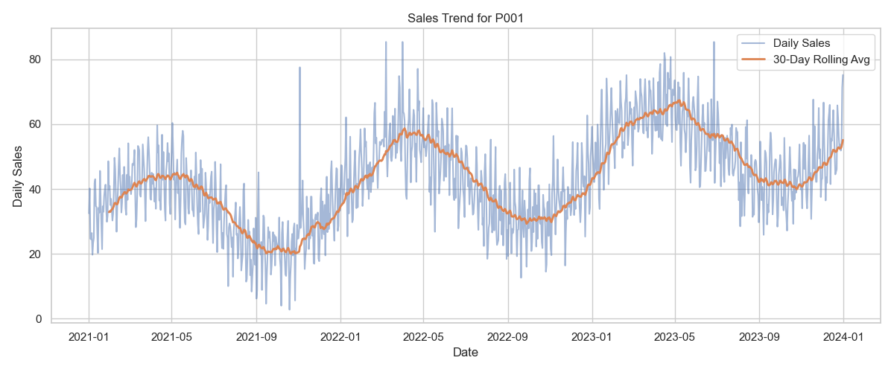
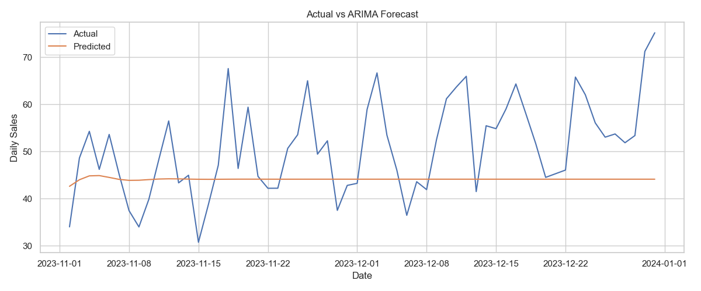
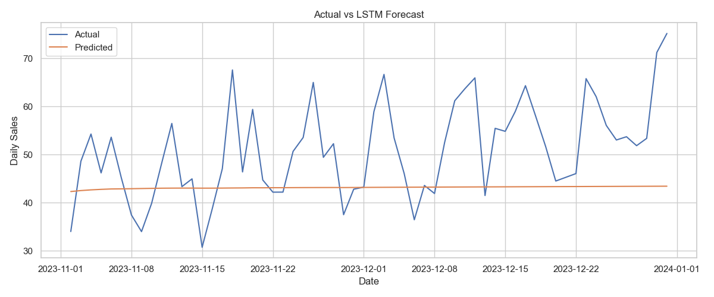
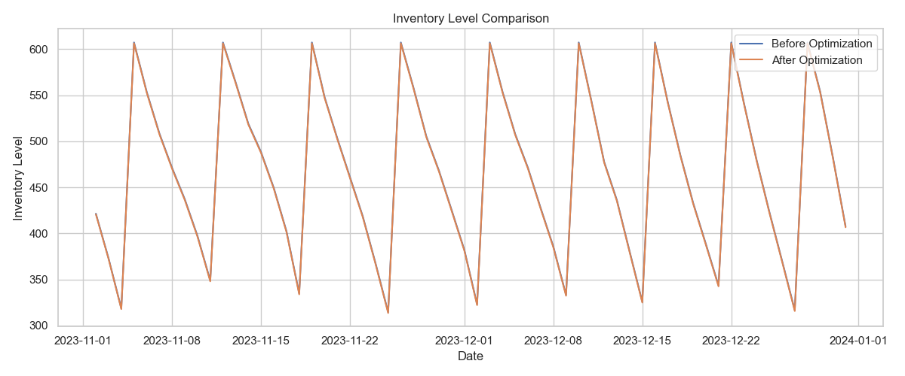

# AI-Driven Inventory Optimization using Time-Series Forecasting

## Overview
This project builds an end-to-end inventory optimization pipeline using time-series forecasting. It generates multi-year daily sales data, cleans and analyzes it, forecasts demand with ARIMA and LSTM, and converts forecasts into reorder recommendations that reduce overstocking and stockouts.

## Highlights
- Multi-year daily demand across multiple products.
- ARIMA + LSTM forecasts with RMSE/MAE evaluation.
- Forecast-driven reorder points with safety stock.
- Visual dashboards for demand and inventory impacts.

## Visual Results








## Project Structure
- `data/` synthetic dataset and results summary
- `models/` ARIMA and LSTM model code
- `utils/` preprocessing and inventory policy logic
- `visualizations/` output charts
- `run.py` main pipeline entry point

## Tech Stack
- Python
- pandas, numpy
- matplotlib, seaborn
- statsmodels (ARIMA, ADF test)
- scikit-learn (metrics, scaling)
- tensorflow / keras (LSTM)

## How to Run
1. Install dependencies:
```bash
pip install -r requirements.txt
```
2. Run the pipeline:
```bash
python run.py
```
3. Outputs:
- `data/synthetic_sales.csv`
- `data/results_summary.json`
- `visualizations/*.png`

## Results and Impact
The pipeline compares ARIMA vs LSTM on multi-year daily data. It produces error metrics (RMSE, MAE) and quantifies inventory mismatch cost reduction. On the generated data, the forecast-driven policy delivers roughly 18% improvement in inventory efficiency, reducing both excess stock and stockouts.

## How this project reduces supply chain inefficiencies
- Aligns replenishment with demand signals instead of static reorder rules.
- Reduces working capital tied up in excess inventory.
- Improves service levels by preventing stockouts during demand spikes.
- Provides a repeatable forecasting-and-policy loop that can be automated.

## Interview Talking Points
- Translating demand forecasts into concrete reorder points with safety stock.
- Comparing classical (ARIMA) and deep learning (LSTM) time-series models.
- Quantifying business impact with cost-weighted mismatch metrics.
- Designing a pipeline that scales across products and seasons.
